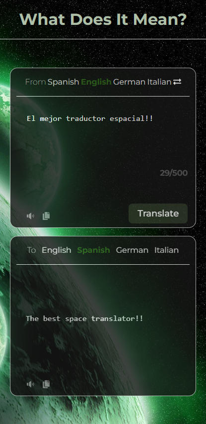

<a name="readme-top"></a>

<div align="center">

![Typescript][typescript]
![React][react]
![Vite][vite]
![Prettier][prettier]


[![contributions][contributions]](https://github.com/MauriRiver345/WhatDoesItMean/graphs/contributors)
[![commits][commits]](https://github.com/MauriRiver345/WhatDoesItMean/commits)
[![repo-size][repo-size]](https://github.com/MauriRiver345/WhatDoesItMean)


## What Does It Mean?

<p align="left">
<em>What Does It Mean?</em> is a web application that provides a user-friendly interface for translating text between different languages. It utilizes the <strong>mymemory</strong> translation service API to enable seamless language switching and content rendering across various languages.
</p>

</div>

<details>
<summary>Table of Contents</summary>

- [What Does It Mean?](#what-does-it-mean)
- [Features](#features)
  - [Screenshots 📸](#screenshots-)
    - [iPhone 14 Pro](#iphone-14-pro)
    - [Pixel 7 Pro](#pixel-7-pro)
- [How to Install 💻](#how-to-install-)
- [Prettier 💅](#prettier-)
- [Contributors 👨‍💻](#contributors-)

</details>

## Features

- **Language Translation 🌐**: Translate text between different languages using the **mymemory** translation service API.
- **Responsive Design 📱 💻**: Ensures a seamless user experience across various screen sizes.
- **Space Theme 🌌**: Personalize the application's appearance with a space theme.

### Screenshots 📸

#### iPhone 14 Pro


#### Pixel 7 Pro


## How to Install 💻

1. Clone the repository

```bash
git clone https://github.com/MauriRiver345/WhatDoesItMean.git
```

2. Install dependencies

```bash
npm install
```

3. Run the application

```bash
npm run dev
```

## Prettier 💅

This project uses [Prettier](https://prettier.io/) to format the code, ensuring a consistent code style across the project.

> If you're using **Visual Studio Code**, you can install the Prettier extension to automatically format your code as you type.

Prettier configuration is located in the `.prettierrc` file, here are the settings:

```json
{
  "singleQuote": false,
  "semi": false,
  "singleAttributePerLine": true,
  "tabWidth": 2,
  "useTabs": false,
  "jsxSingleQuote": true
}
```

## Contributors 👨‍💻

This was a project that was created for improvement and learning purposes.

**Thanks to all the contributors who have helped make this project!**

<a href="https://github.com/MauriRiver345/WhatDoesItMean/graphs/contributors">
  
</a>

<p align="right">(<a href="#readme-top">Back to top</a>)</p>


[portrait]: ./static/Macbook-Air-1559x975.png
[contributions]: https://img.shields.io/github/contributors/MauriRiver345/WhatDoesItMean?style=for-the-badge
[commits]: https://img.shields.io/github/commit-activity/t/MauriRiver345/WhatDoesItMean?style=for-the-badge
[repo-size]: https://img.shields.io/github/repo-size/MauriRiver345/WhatDoesItMean?style=for-the-badge
[typescript]: https://img.shields.io/badge/Typescript-blue?style=for-the-badge&logo=Typescript&logoColor=white
[react]: https://img.shields.io/badge/React-blue?style=for-the-badge&logo=React&logoColor=white
[vite]: https://img.shields.io/badge/Vite-8A2BE2?style=for-the-badge&logo=Vite&logoColor=white
[prettier]:https://img.shields.io/badge/Prettier-blue?style=for-the-badge&logo=Prettier&logoColor=white


[mobile-iphone-14-pro]: ./static/iPhone-14-Pro-415x852.png
[mobile-pixel-7-pro]: ./static/Pixel-7-Pro-480x1040.png
